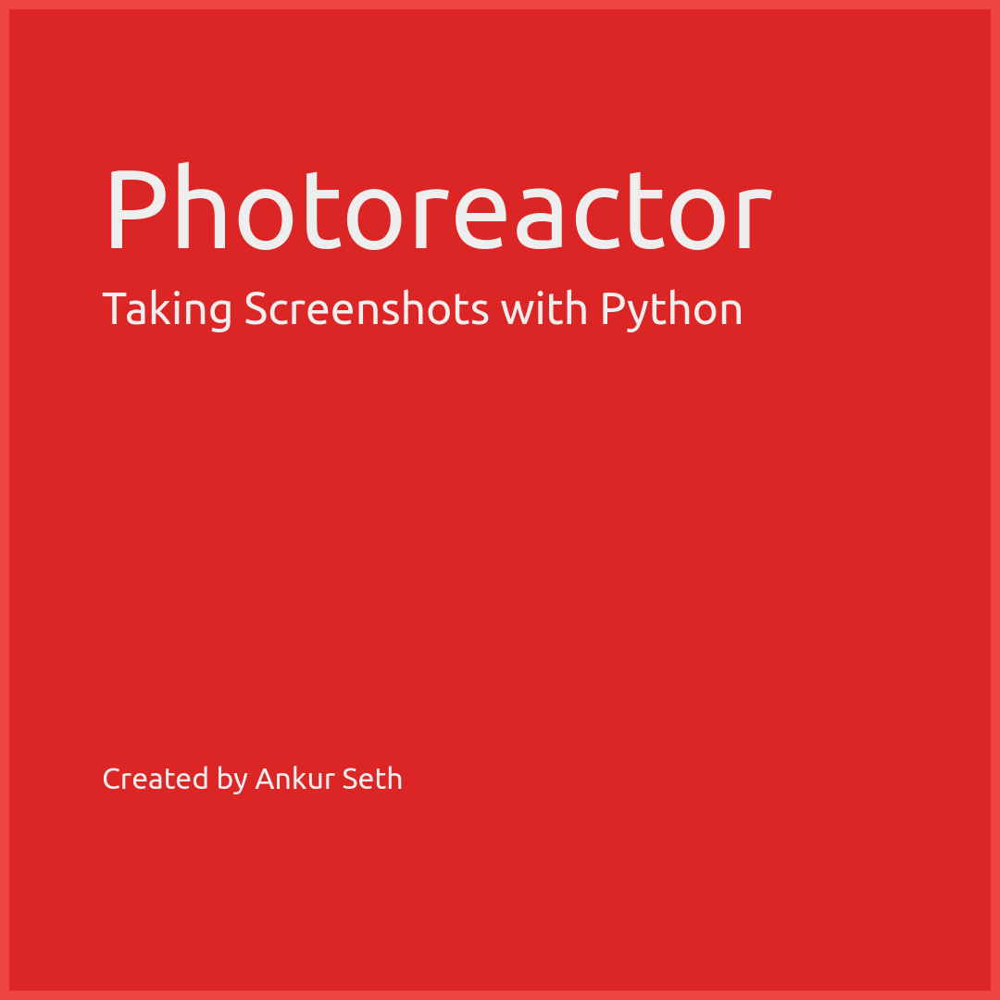

# Photoreactor
Photoreactor is a `React` webapp that allows you to specify document structure
using JSON scripts, and renders it as HTML in the browser.

The combination of Photoreactor and Playwright can be useful for
creating Thumbnails/Screenshots programmatically.

I am using [`readmix`](https://github.com/iaseth/readmix) for generating this README.
You can view the source file [here](https://github.com/iaseth/photoreactor/blob/master/README.md.rx).




The above image was rendered using the following JSON script.

```json
{
    "title":"Example",
    "height":"480px",
    "width":"1080px",
    "padding":"60px 100px",
    "backgroundColor":"#dc2626",
    "color":"#eee",
    "fontFamily":"Ubuntu",
    "fontWeight":"700",
    "borderColor":"#ef4444",
    "borderWidth":"10px",
    "borderStyle":"solid",
    "children":[
        {"text":"Photoreactor","fontSize":"96px"},
        {"text":"Taking Screenshots with Python","fontSize":"48px", "padding": "10px 0px"},
        {"text":"Created by Ankur Seth", "fontSize":"32px", "padding": "60px 0px 0px 0px"}
    ]
}
```


## What is supported
Currently, all rendered elements are `div` and they can contain any number of children
and/or a single `text` node inside them.

* The following CSS properties are supported on each element:

| Property          | CSS Name           |
| ----------------- | ------------------ |
| `backgroundColor` | `background-color` |
| `color`           | `color`            |
| `width`           | `width`            |
| `height`          | `height`           |
| `padding`         | `padding`          |
| `margin`          | `margin`           |
| `fontFamily`      | `font-family`      |
| `fontSize`        | `font-size`        |
| `fontWeight`      | `font-weight`      |
| `lineHeight`      | `line-height`      |
| `textAlign`       | `text-align`       |
| `borderColor`     | `border-color`     |
| `borderWidth`     | `border-width`     |
| `borderStyle`     | `border-style`     |
| `outlineColor`    | `outline-color`    |
| `outlineWidth`    | `outline-width`    |
| `outlineStyle`    | `outline-style`    |
| `position`        | `position`         |
| `top`             | `top`              |
| `right`           | `right`            |
| `bottom`          | `bottom`           |
| `left`            | `left`             |
| `zIndex`          | `z-index`          |

* Tailwind color classes - all `background-color (bg-*)`, `color (text-*)` and  `border-color (border-*)` classes are supported.


## What is not supported yet
The following features are not yet supported in Photoreact
but will be supported in future:

* More CSS properties
* Support for more Tailwind classes
* Images (uploaded/URLs)
* Videos (uploaded)
* Custom Fonts (especially Google Fonts)


## Capturing Screenshots Programmatically
The below script captures Screenshots using Python and Playwright.

```py
import json
import shutil
import time

from playwright.sync_api import Page, expect
from playwright.sync_api import sync_playwright


APP_LOCAL_URL = "http://localhost:5173/"
APP_REMOTE_URL = "https://photoreactor.redpapr.com/"


def record_screencast(script_json, resolution, screenshot_file_path):
	with sync_playwright() as playwright:
		browser = playwright.chromium.launch(headless=True)
		context = browser.new_context(viewport=resolution)
		print("\tCreated browser context")

		page = context.new_page()
		t1 = time.time()
		print("\tCreated new page")
		page.set_default_timeout(0)
		page.goto(APP_REMOTE_URL)
		t2 = time.time()
		td = round(t2-t1, 1)
		print(f"\tOpened photoreactor in {td} seconds")

		page.locator("#inputTextArea").fill(script_json)
		page.locator("#renderButton").click()
		page.wait_for_timeout(1000) # ensures that renderer has started
		page.screenshot(path=screenshot_file_path);

		page.close()
		context.close()
		browser.close()

		print(f"\t\tSaved screenshot: {screenshot_file_path}")


def main():
	script = {
		"title":"Example",
		"height":"480px",
		"width":"1080px",
		"padding":"60px 100px",
		"backgroundColor":"#dc2626",
		"color":"#eee",
		"fontFamily":"Ubuntu",
		"fontWeight":"700",
		"borderColor":"#ef4444",
		"borderWidth":"10px",
		"borderStyle":"solid",
		"children":[
			{"text":"Photoreactor","fontSize":"96px"},
			{"text":"Taking Screenshots with Python","fontSize":"48px", "padding": "10px 0px"},
			{"text":"Created by Ankur Seth", "fontSize":"32px", "padding": "60px 0px 0px 0px"}
		]
	}

	script_json = json.dumps(script)
	resolution = {
		'height': 480,
		'width': 1080
	}
	screenshot_file_path = "screenshot.png"

	record_screencast(script_json, resolution, screenshot_file_path)


if __name__ == '__main__':
	main()

```


## License
MIT License

Copyright (c) Ankur Seth.

Permission is hereby granted, free of charge, to any person obtaining a copy
of this software and associated documentation files (the "Software"), to deal
in the Software without restriction, including without limitation the rights
to use, copy, modify, merge, publish, distribute, sublicense, and/or sell
copies of the Software, and to permit persons to whom the Software is
furnished to do so, subject to the following conditions:

The above copyright notice and this permission notice shall be included in all
copies or substantial portions of the Software.

THE SOFTWARE IS PROVIDED "AS IS", WITHOUT WARRANTY OF ANY KIND, EXPRESS OR
IMPLIED, INCLUDING BUT NOT LIMITED TO THE WARRANTIES OF MERCHANTABILITY,
FITNESS FOR A PARTICULAR PURPOSE AND NONINFRINGEMENT. IN NO EVENT SHALL THE
AUTHORS OR COPYRIGHT HOLDERS BE LIABLE FOR ANY CLAIM, DAMAGES OR OTHER
LIABILITY, WHETHER IN AN ACTION OF CONTRACT, TORT OR OTHERWISE, ARISING FROM,
OUT OF OR IN CONNECTION WITH THE SOFTWARE OR THE USE OR OTHER DEALINGS IN THE
SOFTWARE.


## Credit

This file was generated using [`readmix`](https://github.com/iaseth/readmix).


